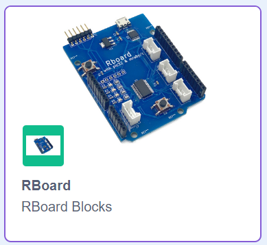
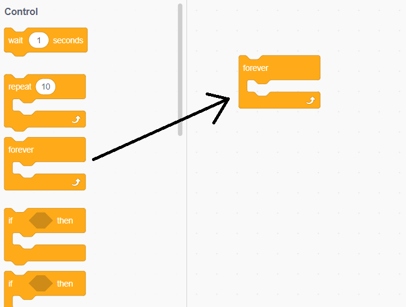
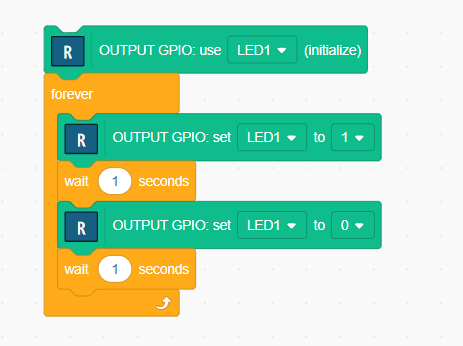
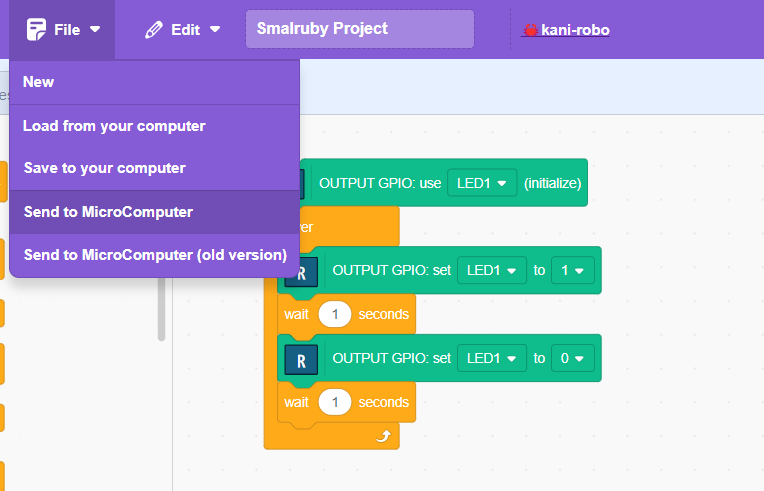
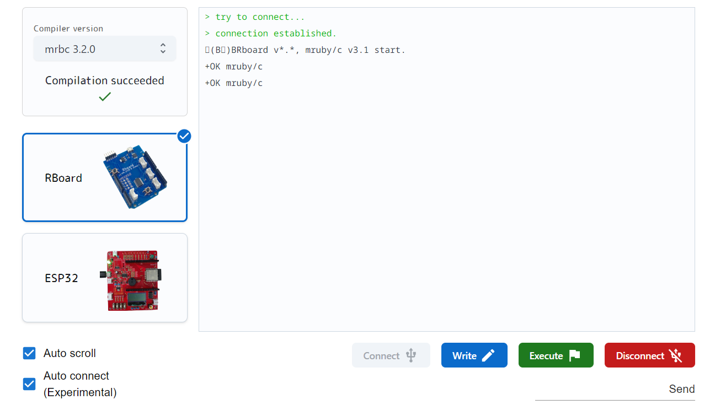

# Try Block Programming

**Block programming** is one of a visual programming method, we select blocks from the tool panel and place them (or arrange them) on the programming field.

Several type blocks are ready. `Control`, `Operators` and `Variabes` are the basic blocks.

In addition, we use `RBoard` blocks that control RBoard functions.

## Include `RBoard` blocks

Press `Add Extension` , then open extentions panel. Choose `RBoard` blocks.

## 1st Block Program

Let's implement the 1st block program.

The 1st program is blinking an LED, which is the simplest program using RBoard.

- Place `forever` block into programming field. 

- Place blocks as follows: 

Note that the block colors are different for each block group. `Control` is orange, `RBoard` is green, and so on.

The functions of the blocks are explained later.

- To execute, select "File"-"Send to MicroComputer" menu. 

This will open a new window where you can transfer your program to RBoard.

## Transfer your program

If you want to change the language, select the language selection icon at the top right as follows: 

You can ready to transfer and execute your program.

Is you see connect button , click this button. Then you see the device selection window. Choose `MCP2221 USB-I2C/UART Combo (COMxx)`. "Connection established" message will be shown.

Press **RS button(Red Button) on RBoard**, then you will see as follows: 

Click "Write". Your program will be written to RBoard.

Click "Execute". Your program will run on RBoard.

You will see blinkng green LED on RBoard.

[**Move to next**](./1st_program_details.md)

[**Back to top**](./README.md)
