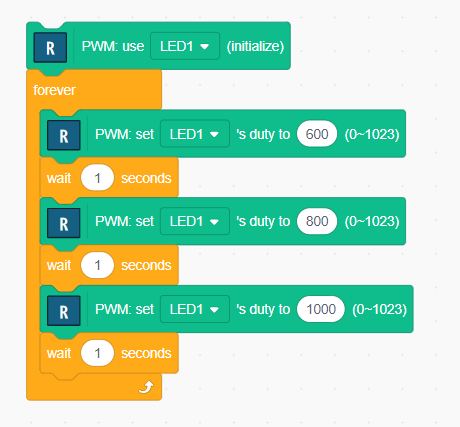

# PWM

The PWM is a power control method for digital microcontrollers. Generally, digital microcontrollers can only set the output voltage to HIGH or LOW. 
The PEM can control the output smoothly.

The PWM stands for Pulse Width Modulation, the output of the PWM signal is changing its HIGH and LOW voltage rapidly, and the ratio of HIGH and LOW can be controlled.


## PWM program

The PWM block can output pwm signal.



The Ruby code is as follows:

```Ruby
pwm0 = PWM.new( 0 )
loop do
  pwm0.duty( ( 600 % 1024 ).to_i )
  sleep(1)
  pwm0.duty( ( 800 % 1024 ).to_i )
  sleep(1)
  pwm0.duty( ( 1000 % 1024 ).to_i )
  sleep(1)
end
```

- The `duty` function sets the ratio of HIGH/LOW, 0% HIGH is `duty(0)` and 100% HIGH is `duty(1024)`.

## Smooth control

If you use variables, you can control LED brightness smoothly. Use the "variable" block and the "repeat until" block.


The Ruby code looks like this. You may find it easy to understand.

```Ruby
pwm0 = PWM.new( 0 )
loop do
  $var1 = 0
  until $var1 > 1023
    pwm0.duty( ( $var1 % 1024 ).to_i )
    sleep(0.001)
    $var1 = $var1 + 1
  end
end
```

## Practice

1. Control the LED on the breadboard.<br>
Pin number for PWM is passed by parameter of `PWM.new`.


[**Move to next**](./2nd_circuit.md)

[**Back to top**](./README.md)
