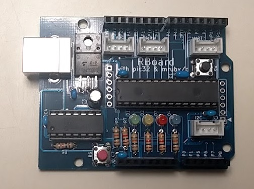
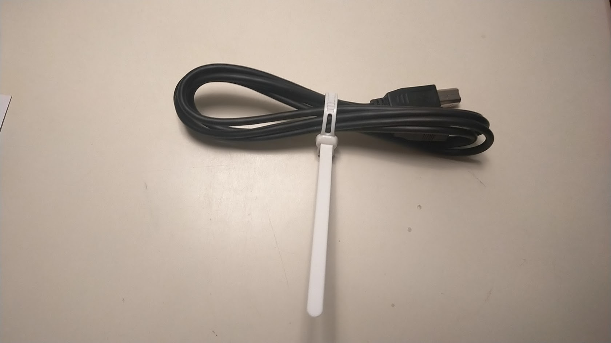
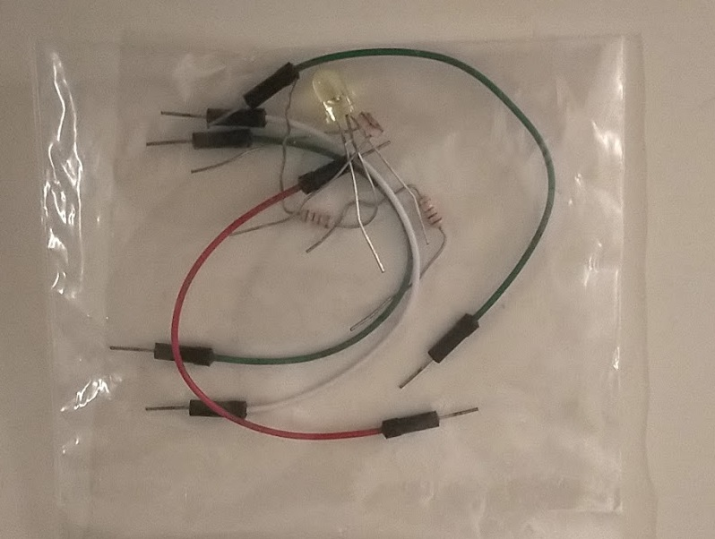
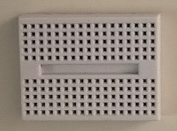
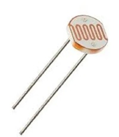
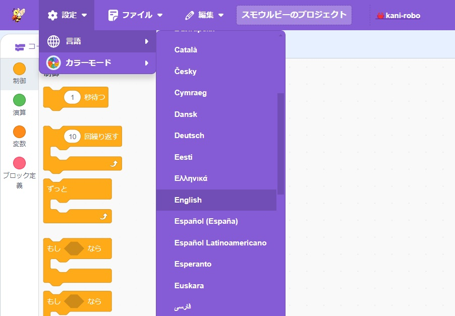

# RBoard and Development site

## mruby/c and RBoard

**mruby/c** is a programming and executing environment for small devices, it's focused on small memory footprint and low power consumption.

**RBoard** is a microcontroller board for mruby/c. The microcontroller on the RBoard contains the mruby/c VM (Virtual Machine) which executes mruby programs.

With RBoard, you just connect cables between RBoard and your laptop. Then you can implement your code on a web site and transfer your program directly to RBoard.

## Check items

- RBoard 

- USB Cable 

- Electrical Parts 

- Breadboard 

## Check electrical parts

- LEDs
- Resistors
- Jumper wires
- Light sensor 

If you need more parts: Ask me.

## Access to Development site

Access to [smalruby](https://ceres.epi.it.matsue-ct.ac.jp/smt2024/).

If necessary, change language as follows: 

[**Back to top**](./README.md)
