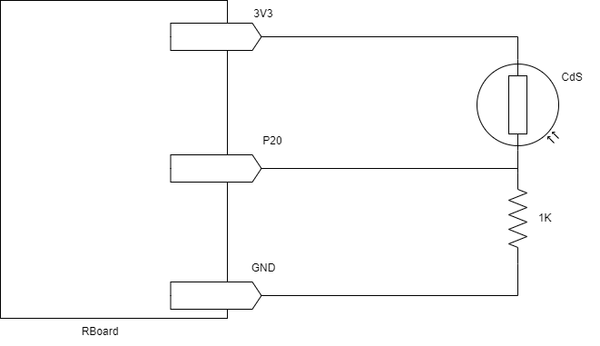
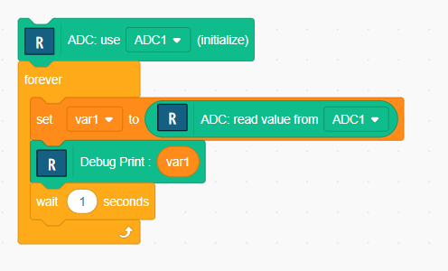

# Using a Sensor

We'll use a brightness sensor called a photoresistor, also known as a CdS sensor.

The resistance value of the CdS sensor varies with brightness. The following circuit can detect the brightness.



- 3V3 pin outputs constant voltage of 3.3V.
- P20 is connected to ADC(Analog Digital Converter) which can measure the voltage of P20.

## ADC Program

ADC (Analog Digital Converter) is a device that can measure the connected input voltage.

The following block program measures the brightness (voltage of P20).




```Ruby
adc20 = ADC.new( 20 )
loop do
  $var1 = adc20.read
  puts( $var1 )
  sleep(1)
end
```

- The `read` function reads the voltage from the ADC.
- The `puts` function can output the variable `var1` to the console.

## Practice

1. Turn on (or off) an LED by brightness, it's like an automatic light.
2. Turn on red/green LED by brightness. If the condition is dark, turn on the red LED, otherwise turn on the green LED. 

<hr/>

[**Back to top**](./README.md)
