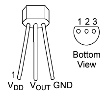
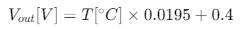

# Using a Temperature Sensor

Use a Temperature sensor "MCP9701", thermistor IC.

The document of the sensor is: https://www.mouser.jp/datasheet/2/268/MCP970X_Family_Data_Sheet_DS20001942-3443103.pdf

|RBoard Pin|MCP9701 Pin|
|---|---|
|3V3|1 V_DD|
|P20|2 V_out|
|GND|3 GND|

The output voltage is by following equation.

## Practice

1. Output temperature (in degree of Celsius).
1. Control LEDs by temperature, like a thermo alert.

[**Back to top**](./README.md)
