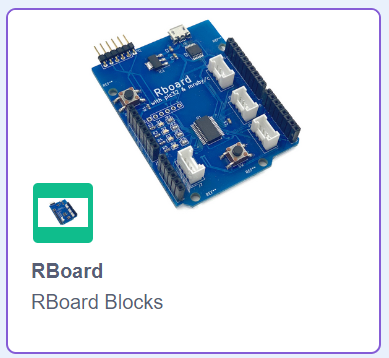
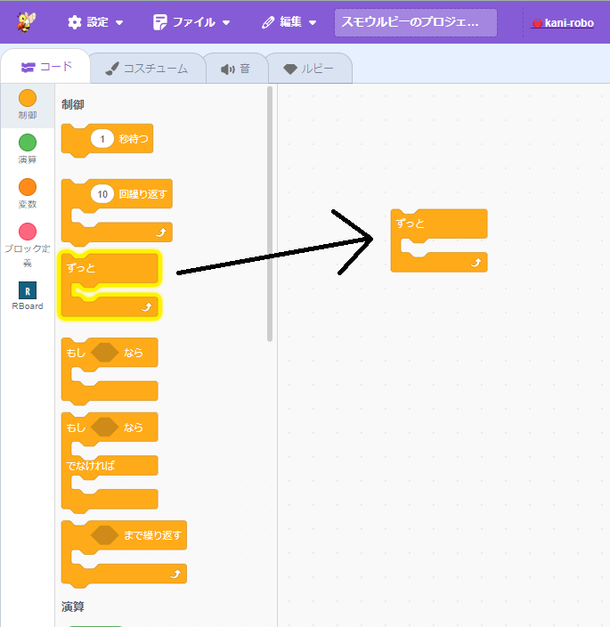
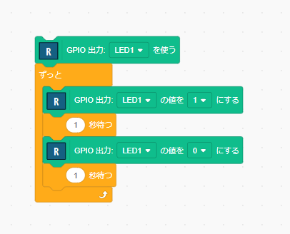
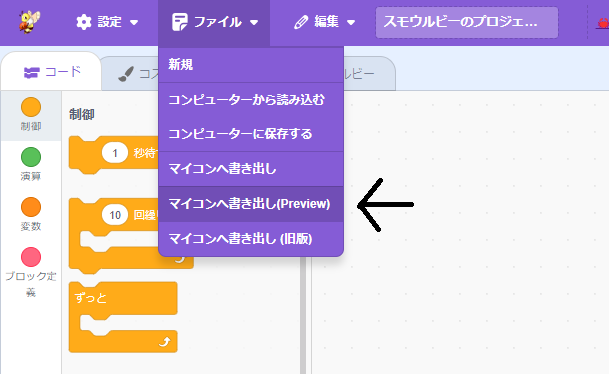
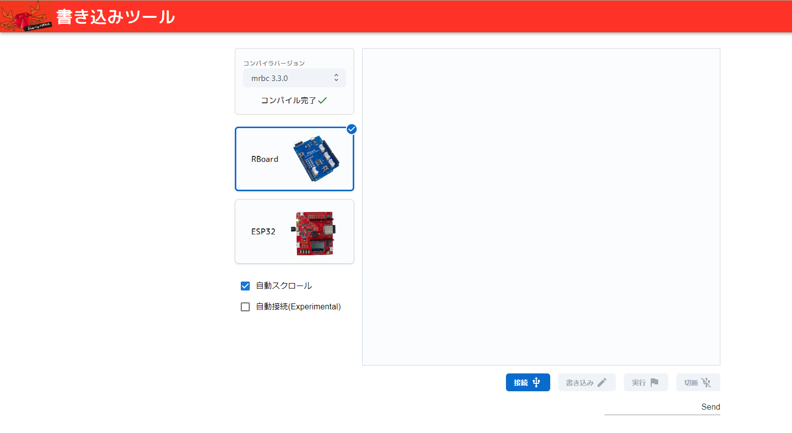

# プログラムを動かしてみよう

今日行うプログラミングでは、「ブロックプログラミング」という手法を使います。画面上にブロックを配置していくことで、プログラムを作成していくことができます。

プログラミングに必要なさまざまな機能は、ブロックとして準備されています。 
これらのブロックを、適切に組み合わせることで、**正しく動作するプログラム**を作成します。

また、使用するマイコンボードを扱うためのブロックもあります。

## `RBoard`の機能ブロックを追加する

画面左下の `拡張機能を追加`  をクリックします。各脳機能を追加するためのウィンドウが表示されます。

表示され拡張機能から、`RBoard` を選択します。

## 最初のプログラム

ここでは、LEDを点滅させるプログラムを作成します。これは、RBoardで動作する最も簡単なプログラムです。

- マウスを使って、「ずっと」ブロックを配置します。 

- 以下のように、「GPIO出力」「1秒待つ」などのブロックを配置していきます。 

    - 「GPIO出力」には、「・・・を使う」と「・・・にする」の違いがあるので注意してください。
    - 「GPIO出力」の値にも注意してください。
    - それぞれのブロックの役割は、後で説明します。

- 完成したプログラムを動かします。[ファイル]メニューから[マイコンへ書き出し]を選択します。

新しいウィンドウが開き、RBoardへの書き込みを行るようになります。

## プログラムの書き込み

- 「書き込みツール」のウィンドウが開きます。ここで、「RBoard」が選択されていなければ、これを選択してください。 

- 作成したプログラムは、パソコンの中にあります。このプログラムを、ケーブルを使って、RBoardマイコンに書き込み（転送）します。
-「接続」ボタンをクリックして、RBoardマイコンと接続します。このとき、デバイスを選択するメニューが表示されます。`MCP2221 USB-I2C/UART Combo (xxxx)`を選択してください。
- RBoardマイコンの RSボタン（赤いボタン）を押します。「書き込み」ボタンが押せるようになるので、「書き込み」ボタンでプログラムを転送します。
- 「実行」ボタンを押すと、RBoardマイコンのプログラムが動き出します。

RBoardマイコンの緑色のLEDが1秒間隔で点滅していれば、正しく動作しています。

[**Move to next**](./1st_program_details.md)

[**Move to next**](./2nd_circuit.md)

[**Back to top**](./README.md)
