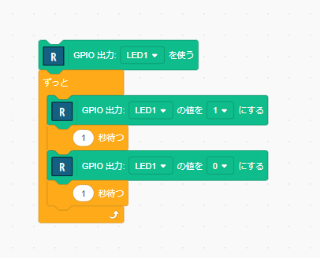

# 最初のプログラムの説明

LEDが点滅するプログラム。

## `GPIO出力: LED1 を使う`

GPIOは、General Purpose Input and Outputの略で、マイコンの入出力（電圧）に関する機能です。 
「GPIO出力」となっているので、この場合は「LED1」という出力の電圧を設定します。 
「LED1」には緑色のLEDが接続されています。

これで、緑色LEDを扱う準備ができました。

## `ずっと`

「ずっと」ブロックは、囲まれた範囲の処理を繰り返します。

## `GPIO出力: LED1 の値を 1 にする`

LED1 の電圧を設定します。1 はLED1の電圧を、高い電圧に設定します。 
これにより、LED1（緑色のLED）に電流が流れて、LEDが点灯します。

## `1 秒待つ`

1秒間プログラムを停止します。 
ここでは、LEDが点灯して、その状態が1秒間継続します。

## `GPIO出力: LED1 の値を 0 にする`

前の例と同じく、LED1 の電圧を 0 に設定します。0 はLED1の電圧を、高い電圧に設定します。 
これにより、LED1（緑色のLED）に電流が流れて、LEDが点灯します。

## LED点滅

以上の動作を繰り返すことから、緑色のLEDが1秒間隔で点滅します。

# 練習

**※ 書き込みツールのウィンドウを閉じてから、プログラムを作成してください。**

- LEDの点滅速度を変えてみてください
- 違う色のLEDを点滅させてください。
- 2つのLEDを交互に点滅させてください。

