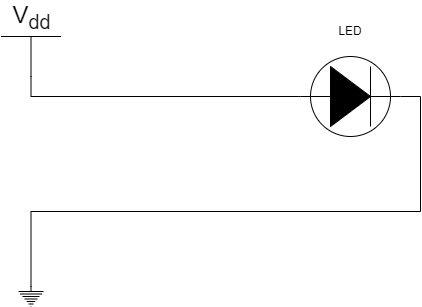
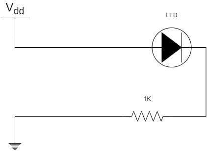
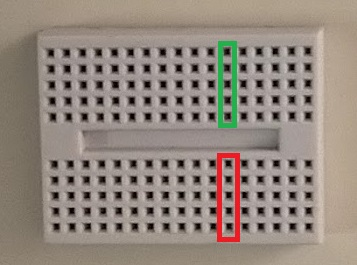
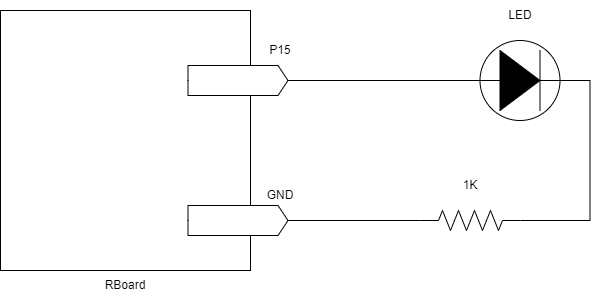
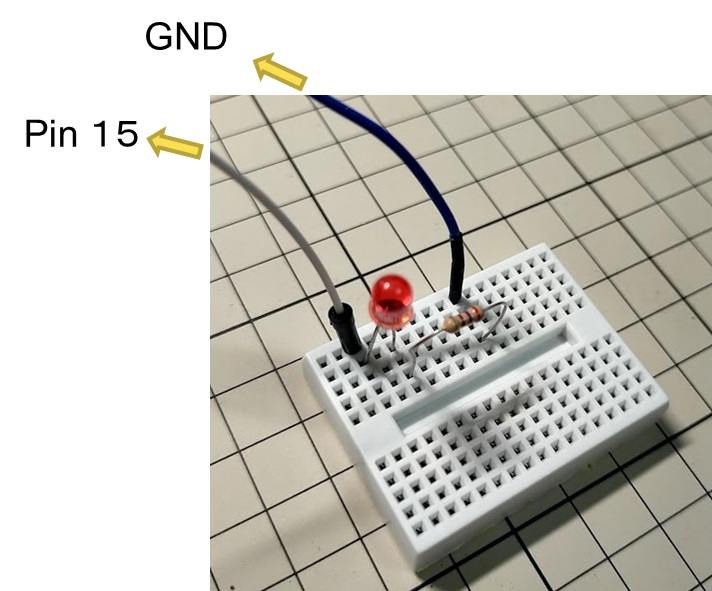
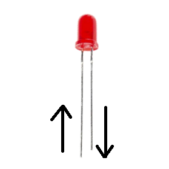
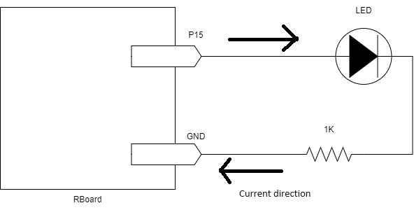
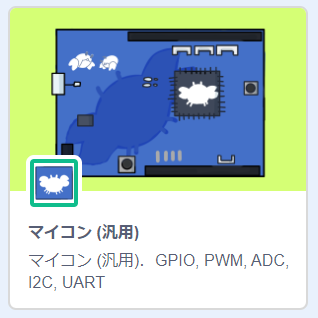
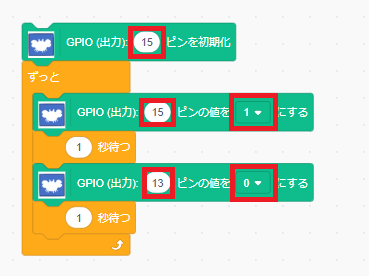

# 電子回路

電子回路を作成し、RBoardマイコンから回路を動かしてみます。

## LEDの動作

LED（Light Emitting Diode）は、電流を流すことで点灯させることができます。この時、LEDを流れる電流が、大きすぎないように気を付ける必要があります。

もっとも簡単なLEDを点灯させる回路は以下のようになりそうですが、この回路は正しくありません。

- 正しくないLEDの回路 
 

実は、LEDの抵抗値は0と考えます。そのため、上の回路では、電流が流れすぎてしまいます。 
そこで、電流の流れを制限するための抵抗を追加します。

- 正しいLEDの回路 

## LEDを含む回路を作成する

今回、電子回路を手軽に作成するため、ブレッドボードを使います。ブレッドボードの表面の穴は、内部で下図のように接続されています。緑色の部分がブレッドボードの内部で接続されています。同様に、赤色の部分もブレッドボードの内部で接続されています。しかし、**緑色と赤色は接続されていない**ので、使用するときは注意してください。

- ブレッドボード 

RBoardは、ピンの電圧をプログラムで制御できます。

例えば、以下のような回路を考えます。

この回路のLEDを点灯させるためには、P15 の電圧を高くします。GNDは常に低い電圧（0V）になっています。

そこで、LEDと抵抗をブレッドボードの穴を使って接続し、下のような回路を作成します。作成した回路から、P15とGNDへジャンパーワイヤーを使って接続します。

### LED接続の注意事項

LEDは電流を一方向にのみ流すという機能があるので、LEDのピンには向きがあります。

LEDのピンの長さと電流の流れる向きは、図のようになっています。回路を流れる電流の向きを考え、ブレッドボードでの回路作成を行ってください。

## LED点滅のプログラム

画面左下の `拡張機能を追加`  をクリックして表示された拡張機能から、`マイコン（汎用）` を選択します。

ここでは、Pin15などのピンを使います。このようなピンは、GPIO(General Purpose Input and Output)と呼ばれます。

次のようなプログラムを作成します。赤枠で示した部分の値を設定しておきます。

このプログラムにより、作成したLEDの回路を動かすことができます。

# 練習

- GPIOピンを使って、2つのLEDを交互に点滅させてみてください。
- マイコンボード上のLEDもGPIOで制御できます。4つのLEDのピンは、0, 1, 5, 6 になっています。 GPIOを使って、マイコンボード上のLEDを点滅させてみてください。

[**Move to next**](./3rd_pwm.md)

[**Back to top**](./README.md)
