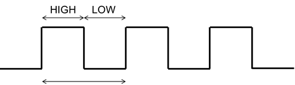
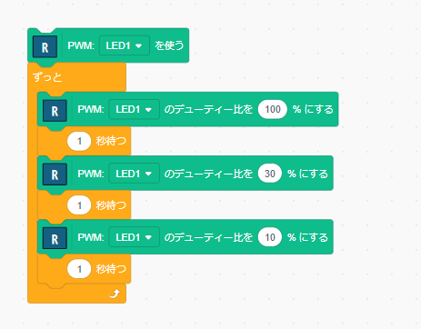
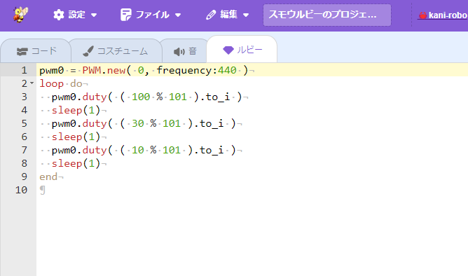
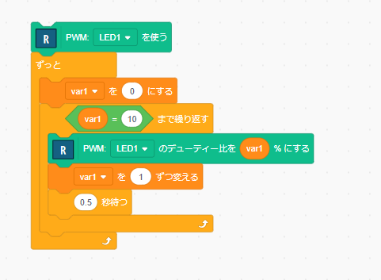

# PWM

LEDの明るさを変化させてみます。

ほとんどすべてのマイコンは、GPIOの機能を持っています。しかし、GPIOで制御できるのは、0または1の値です。つまり、LEDを消灯する(0)またはLEDを点灯する(1)の2つの状態を扱えます。

LEDの明るさを変えるには、PWM(Pulse Width Modulation)と呼ばれる手法を使います。

## PWMの原理

PWMでは、0と1を高速に切り替えることで、疑似的に明るさを表現します。

図のように、周期的にHIGHとLOWを切り替えます。このとき、周期は一定ですが、その中のHIGHとLOWの比率を変えることができます。この比率のことを`デューティ比(Duty Ratio)`と呼びます。



## PWMのプログラム

RBoardマイコン用のPWMは、拡張機能の `RBoard` のものを使います。「マイコン(汎用)」にもPWMがありますので間違えないように注意してください。

以下のようなプログラムを作成します。



このプログラムを動かすと、明るさが3段階に変わることを確認できます。

## プログラムコード

これまで作成してきたプログラムは、プログラム言語Rubyに変換されて実行されています。このことは、プログラム作成の画面で「ルビー」を選択することで確認できます。



最初の `PWM.new( ... )` の箇所で、PWMを使用する設定をしています。ここで指定している `0` は、GPIOのピン0 を意味します。また、frequency は、PWMの周期の周波数を意味します。

設定されたPWMは、pwm0という名前で利用できるようになっていて、これ以降、pwm0 のデューティ比を設定して、LEDの明るさを変化させています。

# 練習

- LEDの回路を作成して、PWMを使ってLEDの明るさを変化させてみてください。


## 参考

以下のようなプログラムを作ると、明るさをスムーズに変化させることができます。



```Ruby
pwm0 = PWM.new( 0, frequency:440 )
loop do
  $var1 = 0
  until $var1 == 10
    pwm0.duty( ( $var1 % 101 ).to_i )
    $var1 += 1
    sleep(0.5)
  end
end
```

## 参考（クイズ？）

「ルビー」のプログラムで、デューティ比を指定するための `duty` の部分では、`( ( 100 % 101 ).to_i )` のように記述されています。

デューティ比の指定で、なぜこのような式になっているのでしょうか？

- 「`%`」は、剰余の計算をします。`a % b` で、aをbで割った時の余り を求めることができます。

<hr/>

[**Move to next**](./4th_sensor.md)

[**Back to top**](./README.md)

