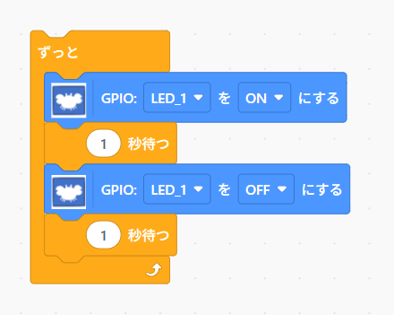

# 2つのLEDを交互に点滅させる

先ほどのプログラムを編集して、2つのLEDを交互に点滅させるプログラムを作ってみてください

１つのLEDを点滅させるプログラム：

- 2つのLEDを点滅させる動作の順序を考えてプログラムを作成します

|LEDの番号|色|
|---|---|
|LED_1|緑色|
|LED_2|黄色|
|LED_3|赤色|
|LED_4|青色|

[**Move to next**](./step4.md)

[**Back to top**](./README.md)

