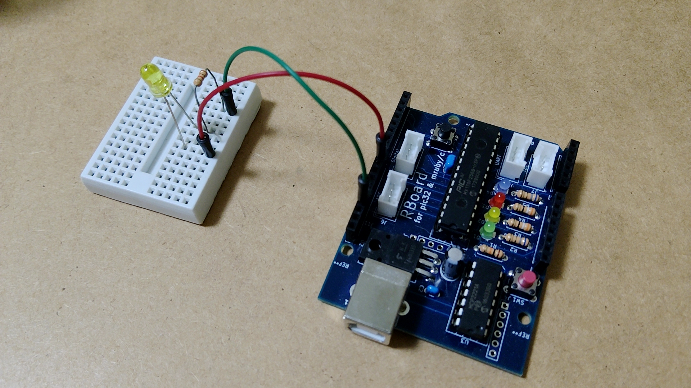
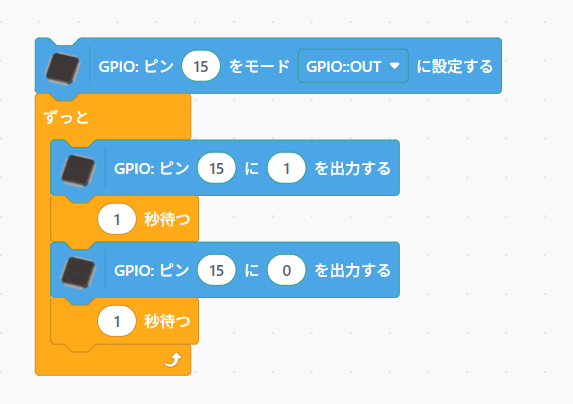

# 電子回路を作成する

電子回路を作成し、マイコンボードから回路を動かしてみます。

## LEDの動作

LED（Light Emitting Diode）は、電流を流すことで点灯させることができます。

- 物理の法則から、電流は高い電位から低い電位に向かって流れます。したがって、LEDに電流を流すためには、Vddの電位（電圧）を高くします。
- 図の下側の端子はGND（グランド）と呼び、常に低い電位（電圧）になっています（以下、電位を電圧として説明していきます）。
- 流れる電流の量を制限するため、抵抗「1K」を入れています。

ここでは、この回路を作成して、LEDを点滅させます。

## LEDを含む回路を作成する

今回、電子回路を手軽に作成するため、ブレッドボードを使います。ブレッドボードの表面の穴は、内部で下図のように接続されています。緑色の部分がブレッドボードの内部で接続されています。同様に、赤色の部分もブレッドボードの内部で接続されています。しかし、**緑色と赤色は接続されていない**ので、使用するときは注意してください。

- ブレッドボード 

マイコンボードでは、ピンの電圧をプログラムで制御できます。

例えば、以下のような回路とします。

この回路のLEDを点灯させるためには、P15 の電圧を高くします。GNDは常に低い電圧（0V）になっています。

そこで、LEDと抵抗をブレッドボードの穴を使って接続し、下のような回路を作成します。作成した回路から、P15とGNDへジャンパーワイヤーを使って接続します。P15は、マイコンボードでは「D15」と印刷されています（デジタル15の意味）。

### LED接続の注意事項

LEDは電流を一方向にのみ流すという機能があるので、LEDのピンには向きがあります。

LEDのピンの長さと電流の流れる向きは、図のようになっています。回路を流れる電流の向きを考え、ブレッドボードでの回路作成を行ってください。

完成した回路

## LED点滅のプログラム

このプログラムを動かすには、P15などのピンを使います。このようなピンは、GPIOピンと呼ばれます（GPIO=General Purpose Input Output）。

次のようなプログラムを作成します。赤枠で示した部分の値を設定しておきます。

このプログラムにより、作成したLEDの回路を動かすことができます。

# 練習

- GPIOピンを使って、2つのLEDを交互に点滅させてみてください。

[**Move to next**](./step5.md)

[**Back to top**](./README.md)
