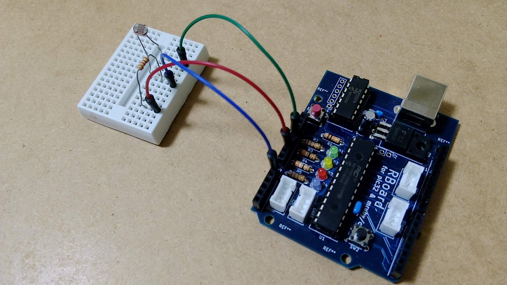
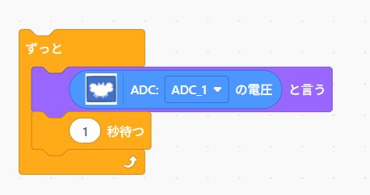
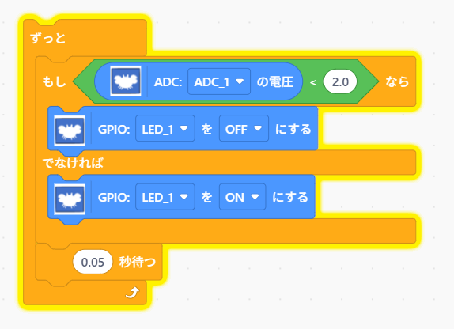

# step4 センサーを使ってみる

明るさセンサーを使ってみます。

今回、明るさセンサとして、CdSセンサを使います。このセンサは、明るさによって抵抗値が変化する特性があります。

## 明るさセンサーの使い方

GPIOを使って、CdSセンサーの抵抗値を計測します。マイコンのGPIO機能は、抵抗値を計測するようには作られておらず、**電圧値を計測する**ようになっています。

そこで、抵抗値を電圧値として計測できるようにする回路を作成します。この回路は、次のようになります。 
図中の、3V3は電源で、3.3Vの電圧がかかっています（電源の＋極と考えてください）。

CdSの抵抗値が変化すると、1Kの抵抗を流れる電流も変化します。オームの法則から、A0の電圧値も変化することになります。

完成した回路

## 明るさの計測

次のようなプログラムで、電圧値を計測します。プログラム中のADC1は、マイコンボードのA0に割り当てられています。

次のようにして、ADC1の電圧を画面に出力するプログラムを作成します。

CdSを手で覆うなどして、明るさを変化させてみて、電圧値も変化していることを確認してください。

## 明るさによってLEDを制御する

「暗くなると、LEDが点灯する」プログラムを作成します。

「もし～でなければ～」のブロックを使うことで、条件判定ができます。

以下のようｎプログラムになります。「もし」の部分の値（図では 2.0 ）は手元で確認した値を使って調整してください。

※ 回路に変更はありません

[**Back to top**](./README.md)
